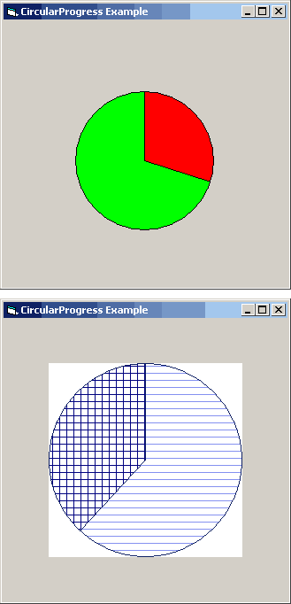



## CircularProgress

### Description

Basically, this control is a "progress circle," rather than a progress bar. It enables the programmer to take a rather high amount of ustomization into a "progress circle" that will help to enhance the interface of their program.

Unique Features:

- Ultra-fast graph rendering

- Was tested on a 166 mHz Pentium with 32mb RAM, 1mb video memory, on Windows 95a, on a 400x400 graph.

- The result of the above test was that the circle was drawn almost instantaneously: It took an average of 80-100 ticks (milliseconds) for each test! Now talk about speed!

- Primitive but powerful customization

- 7 different Fill Styles

- 16.7 million Fill & Outline Colors (plus system colors!)

- 2 types of graphs drawn (experimental)

You MUST note, however, that even though I have tested it rather thoroughly for bugs, it is hard to cure bugs between XP and 95 (the two platforms I tested it on). You have any trouble, explain the problem, and explain how you fixed it, or if you need help. I hope you enjoy it!
 
### More Info
 

             |
---                |---
**Submitted On**   |2003-05-27 18:50:38
**By**             |[Rodent from the Pointe](https://github.com/Planet-Source-Code/PSCIndex/blob/master/ByAuthor/rodent-from-the-pointe.md)
**Level**          |Intermediate
**User Rating**    |4.3 (13 globes from 3 users)
**Compatibility**  |VB 6\.0
**Category**       |[Custom Controls/ Forms/  Menus](https://github.com/Planet-Source-Code/PSCIndex/blob/master/ByCategory/custom-controls-forms-menus__1-4.md)
**World**          |[Visual Basic](https://github.com/Planet-Source-Code/PSCIndex/blob/master/ByWorld/visual-basic.md)
**Archive File**   |[CircularPr1593065272003\.zip](https://github.com/Planet-Source-Code/rodent-from-the-pointe-circularprogress__1-45763/archive/master.zip)

